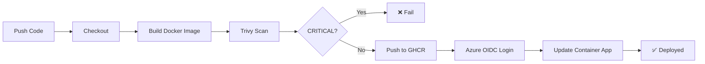

# 🚀 GraTech CometX - CI/CD Setup Complete

## ✅ ما تم تجهيزه:

### 📦 GitHub Actions Workflows

#### 1. **deploy.yml** - CI/CD Pipeline
```yaml
✓ OIDC Authentication (بدون أسرار)
✓ GitHub Container Registry (GHCR)
✓ Trivy Security Scanning (CRITICAL only)
✓ Multi-stage Docker Build
✓ Azure Container Apps Deployment
✓ Automatic rollout
```

**الميزات:**
- ✅ `permissions: packages: write` لدفع الصور
- ✅ `permissions: id-token: write` لـ OIDC
- ✅ Build with cache (GitHub Actions Cache)
- ✅ Security scan قبل النشر
- ✅ Automatic deployment to Container Apps

#### 2. **codeql.yml** - Code Security Analysis
```yaml
✓ Weekly security scans
✓ JavaScript/TypeScript analysis
✓ Automated vulnerability detection
```

#### 3. **dependabot.yml** - Dependency Updates
```yaml
✓ Weekly npm updates
✓ Docker base image updates
✓ GitHub Actions updates
```

### 🔐 المتطلبات (GitHub Secrets)

أضف هذه في: `Repository → Settings → Secrets and variables → Actions`

```bash
AZURE_CLIENT_ID        = 9036905f-24d2-4f5e-99e7-98b8638b5abe
AZURE_TENANT_ID        = a1cc28df-8965-4e03-96cb-5d6172ff55a5
AZURE_SUBSCRIPTION_ID  = dde8416c-6077-4b2b-b722-05bf8b782c44
```

### 🌐 Azure Resources

```bash
Resource Group:    rg-cometx-prod
Location:          eastus2
Container App:     ca-cometx-api
Environment:       cometx-env
Image Registry:    ghcr.io/Grar00t/gratech-cometx
```

### 📝 Workflow Triggers

| Event | Action |
|-------|--------|
| `push` to `main` | Build → Scan → Push → Deploy |
| `pull_request` | Build → Scan only (no deploy) |
| Manual | Via GitHub Actions UI |

### 🔄 Deployment Flow



### 📚 Documentation References

- [Azure OIDC with GitHub Actions](https://learn.microsoft.com/en-us/azure/developer/github/connect-from-azure-openid-connect)
- [GitHub Container Registry](https://docs.github.com/packages/working-with-a-github-packages-registry/working-with-the-container-registry)
- [Docker Build Push Action](https://github.com/docker/build-push-action)
- [Trivy Action](https://github.com/aquasecurity/trivy-action)
- [Azure Container Apps](https://learn.microsoft.com/en-us/azure/container-apps/)

### 🎯 Next Steps

1. ✅ **Create GitHub Repository**
   ```bash
   # على GitHub: https://github.com/new
   # اسم الـ repo: gratech-cometx
   # Owner: Grar00t (أو gratech-sa إذا كان organization)
   ```

2. ✅ **Push Code**
   ```bash
   git remote add origin https://github.com/Grar00t/gratech-cometx.git
   git push -u origin main
   ```

3. ✅ **Add GitHub Secrets**
   - Repository → Settings → Secrets → Actions
   - أضف الثلاثة secrets المذكورة أعلاه

4. ✅ **Watch First Deployment**
   - انتظر Actions تشتغل تلقائياً
   - راقب: Build → Scan → Push → Deploy

### 🌐 Custom Domains (Optional)

لإضافة نطاقات مخصصة (`api.gratech.sa`):

1. **DNS Setup** (CNAME مباشر - مهم للشهادة المُدارة):
   ```
   api.gratech.sa → ca-cometx-api.<env>.azurecontainerapps.io
   ```

2. **Add to Container App**:
   ```bash
   az containerapp hostname add \
     --hostname api.gratech.sa \
     --resource-group rg-cometx-prod \
     --name ca-cometx-api
   ```

3. **Managed Certificate** (مجاني من Azure):
   - يتم إصداره تلقائياً بعد التحقق من DNS
   - يتجدد تلقائياً

### ⚠️ Important Notes

- ✅ **GHCR Images**: تُنشر على `ghcr.io/Grar00t/gratech-cometx`
- ✅ **Public/Private**: الصور private افتراضياً (يمكن تغييرها)
- ✅ **Permissions**: `packages: write` ضروري للدفع
- ✅ **OIDC**: بدون أي أسرار ثابتة في GitHub
- ✅ **Trivy**: يفشل فقط عند CRITICAL vulnerabilities

### 🐛 Troubleshooting

**Issue**: `denied: installation not allowed to Create organization package`
**Solution**: أضف `permissions: packages: write` في الـ job

**Issue**: Azure login failed
**Solution**: تأكد من Secrets صحيحة + Federated Credential مُعد

**Issue**: Container App not updating
**Solution**: تأكد من اسم Resource Group و Container App

### 📊 Monitoring

```bash
# View Container App logs
az containerapp logs show \
  --name ca-cometx-api \
  --resource-group rg-cometx-prod \
  --follow

# Get app URL
az containerapp show \
  --name ca-cometx-api \
  --resource-group rg-cometx-prod \
  --query "properties.configuration.ingress.fqdn" -o tsv
```

---

**🎉 Everything is ready! Push to GitHub to start your first deployment!**
