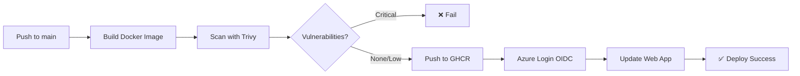

# 🚀 GraTech CometX - Azure Deployment Guide

Complete setup for deploying GraTech CometX to Azure with GitHub Actions and OIDC authentication.

## 🎯 Features

- ✅ **OIDC Authentication** - No secrets stored, uses Workload Identity Federation
- ✅ **Automated CI/CD** - GitHub Actions for build, scan, and deploy
- ✅ **Security Scanning** - Trivy for container vulnerabilities + CodeQL for code analysis
- ✅ **Docker Containerization** - Multi-stage builds with Nginx
- ✅ **Dependabot** - Automated dependency updates
- ✅ **Production Ready** - Azure Web App with auto-scaling

## 📋 Prerequisites

1. **Azure Account** with active subscription
2. **GitHub Account** with repository access
3. **Azure CLI** installed ([Download](https://learn.microsoft.com/en-us/cli/azure/install-azure-cli))
4. **PowerShell** 7+ ([Download](https://github.com/PowerShell/PowerShell))

## 🚀 Quick Start

### Step 1: Run Azure Setup Script

Open PowerShell in the project directory:

```powershell
# Login to Azure (if not already logged in)
az login

# Run the setup script
.\setup-azure.ps1
```

**Options:**
```powershell
# Delete existing resources and recreate
.\setup-azure.ps1 -DeleteExisting

# Use specific subscription
.\setup-azure.ps1 -SubscriptionId "your-subscription-id"

# Custom resource group and location
.\setup-azure.ps1 -ResourceGroupName "my-rg" -Location "eastus"
```

### Step 2: Add GitHub Secrets

The script will output three values. Add them to your GitHub repository:

1. Go to: **Repository → Settings → Secrets and variables → Actions**
2. Click **New repository secret**
3. Add these three secrets:

```
AZURE_CLIENT_ID        = [value from script]
AZURE_TENANT_ID        = [value from script]
AZURE_SUBSCRIPTION_ID  = [value from script]
```

### Step 3: Initialize Git & Push

```powershell
# Initialize git (if not done)
git init
git add .
git commit -m "Initial commit: GraTech CometX"

# Add remote (replace with your repo URL)
git remote add origin https://github.com/gratech-sa/gratech-cometx.git

# Push to main branch (triggers deployment)
git branch -M main
git push -u origin main
```

## 🏗️ What Gets Created

| Resource | Name | Purpose |
|----------|------|---------|
| Resource Group | `rg-cometx-prod` | Container for all resources |
| App Service Plan | `asp-cometx-prod` | Hosting plan (P1v3 Linux) |
| Web App | `app-cometx-web` | Your application |
| App Registration | `gratech-cometx-oidc` | OIDC authentication |
| Federated Credentials | `github-oidc-main`, `github-oidc-pr` | GitHub Actions access |

## 🔐 Security Features

### OIDC Authentication
- No client secrets stored
- Short-lived tokens
- Scoped to specific branches/PRs

### Automated Scanning
- **Trivy** - Scans Docker images for vulnerabilities
- **CodeQL** - Analyzes code for security issues
- **Dependabot** - Weekly dependency updates

### Branch Protection (Recommended)
1. Go to: **Repository → Settings → Branches**
2. Add rule for `main` branch:
   - ✅ Require pull request reviews
   - ✅ Require status checks (build-scan-push)
   - ✅ Require branches to be up to date

## 📦 Docker Image

Built and pushed to GitHub Container Registry (GHCR):
```
ghcr.io/gratech-sa/gratech-cometx:latest
```

### Local Testing

```powershell
# Build image
docker build -t gratech-cometx:local .

# Run locally
docker run -p 8080:8080 gratech-cometx:local

# Open browser
start http://localhost:8080
```

## 🌐 Deployment

### Automatic Deployment
- Push to `main` branch triggers deployment
- Pull requests trigger build & scan (no deploy)

### Manual Deployment
1. Go to: **Repository → Actions**
2. Select **Build, Scan & Deploy to Azure**
3. Click **Run workflow**

## 📊 Monitoring

### Web App Logs
```powershell
# Stream logs
az webapp log tail --name app-cometx-web --resource-group rg-cometx-prod

# Download logs
az webapp log download --name app-cometx-web --resource-group rg-cometx-prod
```

### Application Insights (Optional)
```powershell
# Create Application Insights
az monitor app-insights component create \
  --app cometx-insights \
  --location westeurope \
  --resource-group rg-cometx-prod

# Get instrumentation key
az monitor app-insights component show \
  --app cometx-insights \
  --resource-group rg-cometx-prod \
  --query instrumentationKey -o tsv
```

## 🌍 Custom Domain (Optional)

### Add Custom Domain

```powershell
# Map domain
az webapp config hostname add \
  --webapp-name app-cometx-web \
  --resource-group rg-cometx-prod \
  --hostname yourdomain.com

# Enable HTTPS
az webapp config ssl bind \
  --certificate-thumbprint <thumbprint> \
  --ssl-type SNI \
  --name app-cometx-web \
  --resource-group rg-cometx-prod
```

### Azure DNS (Recommended)

```powershell
# Create DNS zone
az network dns zone create \
  --name gratech.sa \
  --resource-group rg-cometx-prod

# Add A record
az network dns record-set a add-record \
  --resource-group rg-cometx-prod \
  --zone-name gratech.sa \
  --record-set-name "@" \
  --ipv4-address <web-app-ip>

# Add CNAME for www
az network dns record-set cname set-record \
  --resource-group rg-cometx-prod \
  --zone-name gratech.sa \
  --record-set-name "www" \
  --cname "app-cometx-web.azurewebsites.net"
```

## 🔧 Troubleshooting

### Deployment Fails

**Check GitHub Actions logs:**
1. Repository → Actions → Failed workflow
2. Click on failed job for details

**Common issues:**
- GitHub Secrets not added correctly
- Docker build errors (check Dockerfile)
- Azure permissions (verify RBAC roles)

### Web App Not Starting

```powershell
# Check logs
az webapp log tail --name app-cometx-web --resource-group rg-cometx-prod

# Restart app
az webapp restart --name app-cometx-web --resource-group rg-cometx-prod

# Check container logs
az webapp log show --name app-cometx-web --resource-group rg-cometx-prod
```

### OIDC Authentication Issues

```powershell
# Verify federated credentials
az ad app federated-credential list --id <app-id>

# Verify role assignments
az role assignment list --assignee <app-id>
```

## 🧹 Cleanup

### Delete All Resources

```powershell
# Option 1: Using script
.\setup-azure.ps1 -DeleteExisting

# Option 2: Manual deletion
az group delete --name rg-cometx-prod --yes

# Option 3: Delete App Registration
az ad app delete --id <app-id>
```

## 📚 Resources

- [Azure Web Apps Documentation](https://learn.microsoft.com/en-us/azure/app-service/)
- [GitHub Actions with Azure](https://learn.microsoft.com/en-us/azure/developer/github/connect-from-azure)
- [Workload Identity Federation](https://learn.microsoft.com/en-us/azure/active-directory/develop/workload-identity-federation)
- [Trivy Scanner](https://github.com/aquasecurity/trivy)
- [CodeQL Documentation](https://codeql.github.com/docs/)

## 🔄 Workflow Summary



## 📝 Project Structure

```
gratech-cometx/
├── .github/
│   ├── workflows/
│   │   ├── deploy.yml       # Main CI/CD pipeline
│   │   └── codeql.yml       # Security scanning
│   └── dependabot.yml       # Dependency updates
├── src/                     # React source code
├── Dockerfile               # Multi-stage build
├── .dockerignore           # Docker ignore rules
├── setup-azure.ps1         # Azure setup script
└── README.md               # This file
```

## 🎯 Environment Variables (Optional)

Add to Web App if needed:

```powershell
az webapp config appsettings set \
  --name app-cometx-web \
  --resource-group rg-cometx-prod \
  --settings \
    NODE_ENV=production \
    API_URL=https://api.gratech.sa \
    ANOTHER_VAR=value
```

## 🤝 Support

For issues or questions:
- 📧 Email: support@gratech.sa
- 🌐 Website: https://gratech.sa
- 💬 GitHub Issues: https://github.com/gratech-sa/gratech-cometx/issues

---

**Made with ❤️ by GraTech AI**
