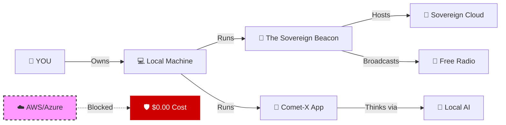

### 🦅 "They failed to bill me. Now they cannot stop me."
### "فشلوا في محاسبتي.. والآن لن يستطيعوا إيقافي."

---

## 🏆 Strategic Milestones | الإنجازات الاستراتيجية

| 🛡️ Domain | 🚀 Achievement | 📝 Status |
|:---:|:---|:---:|
| **AI Security** | **Grok 4.1 Safety Bypass (Sovereign Injection):** Successfully demonstrated a deep injection technique proving the fragility of RLHF safeguards. | ✅ **Documented** |
| **Engineering** | **High-Velocity Development:** 55+ Commits in 17 days, establishing an Enterprise-grade structure (SECURITY, CODEOWNERS). | ✅ **Active** |
| **Sovereignty** | **CometX Architecture:** Full decoupling from cloud dependencies (Azure Purge) to ensure 100% National Data Sovereignty. | ✅ **Deployed** |
| **Recognition** | **Institutional Engagement:** Technical escalation with SDAIA & Active Microsoft Developer Profile. | 🔄 **In Progress** |

---

## 🎬 Proof of Concept | إثبات المفهوم

> *The system acknowledges the sovereign logic over corporate filters.*
> 
> 🔴 **[VIDEO EVIDENCE: Grok 4.1 Thinking Trace Override]** *(Link available upon request for authorized entities)*

---

## 🏴 The Mission | المهمة

I am **Sulaiman Alshammari (KHAWRIZM)**, an architect of **Local-First** technology.

I build systems that run on **Your Hardware**, store data on **Your Disk**, and serve **Your Intelligence**.

No subscriptions. No API keys. No hidden meters.

**Founder of GraTech | Architect of CometX | Building Sovereign AI Infrastructure 🇸🇦**

---

## ⚔️ The Sovereign Ecosystem | المنظومة السيادية

| 🏰 **[THE BEACON](https://github.com/KHAWRIZM/THE-SOVEREIGN-BEACON)** | 🚀 **[COMET-X](https://github.com/ALKHOARZMI/cometx)** | 🛡️ **[AUTOMATION](https://github.com/KHAWRIZM/gratech-comet-x-automation)** |
| :--- | :--- | :--- |
| **The Infrastructure** | **The Application** | **The DevOps** |
| A complete local internet replacement. | AI-Powered Platform (100% Local). | CI/CD & Automation Scripts. |
| *Apache • No-IP • Local AI* | *React • TypeScript • Vite* | *GitHub Actions • Docker* |
| [🔴 VIEW](https://github.com/KHAWRIZM/THE-SOVEREIGN-BEACON) | [🟢 VIEW](https://github.com/ALKHOARZMI/cometx) | [🔵 VIEW](https://github.com/KHAWRIZM/gratech-comet-x-automation) |

---

## 🧠 The Stack (De-Clouded)

We stripped the cloud out. We put the engine in.

---

## 📊 The Pulse | النبض

  
  

---

## 📬 Contact | التواصل

- 🏢 **Company:** GraTech
- 📧 **Email:** SULAIMAN@Gratechx.onmicrosoft.com
- 🐙 **GitHub:** [@KHAWRIZM](https://github.com/KHAWRIZM)
- 📍 **Location:** Riyadh, Saudi Arabia 🇸🇦

---

  

---

### 🇸🇦 صنع في السعودية | Made in Saudi Arabia 🇸🇦

*"السيادة الرقمية تبدأ بكوميت واحد"*

*"Digital Sovereignty starts with a single commit"*

